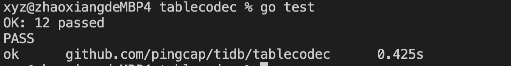

# Project 1: Relational Algebra
## 解题思路
本次作业的主要工作是实现DecodeRecordKey和DecodeIndexKeyPrefix函数。
### DecodeRecordKey函数的实现
RecordKey的格式为tablePrefix_tableID_recordPrefixSep_rowID, 主要思路是逐步根据RecordKey的格式逐步截断Key，在截断的过程中要对错误格式进行检查，实现的函数如下:
```go
// DecodeRecordKey decodes the key and gets the tableID, handle.
func DecodeRecordKey(key kv.Key) (tableID int64, handle int64, err error) {
	// Decode tablePrefix_tableId
    // Check tablePrefix  
	if len(key) < tablePrefixLength {
		return 0, 0, errInvalidKey.GenWithStack("invalid index key - %q", key)
	}
	if !hasTablePrefix(key){
		return 0, 0, errInvalidKey.GenWithStack("invalid index key - %q", key)
	}
    // Decode tableId
	tempKey := key[tablePrefixLength:]
	tempKey, tableID, err = codec.DecodeInt(tempKey)
	if err != nil{
		return 0, 0, errors.Trace(err)
	}

	// Decode recordPrefix_rowId
    // Check recordPrefix
	if len(tempKey) < recordPrefixSepLength {
		return 0, 0, errInvalidKey.GenWithStack("invalid index key - %q", key)
	}
	if !hasRecordPrefixSep(tempKey){
		return 0, 0, errInvalidKey.GenWithStack("invalid index key - %q", key)
	}
    // Decode rowId
	tempKey = tempKey[recordPrefixSepLength:]
	tempKey, handle, err = codec.DecodeInt(tempKey)
	if err != nil{
		return 0, 0, errors.Trace(err)
	}

    // Ensure there are no characters after rowId
	if len(tempKey) > 0{
		return 0, 0, errInvalidKey.GenWithStack("invalid index key - %q", key)
	}

	return tableID, handle, nil
}
```
### DecodeIndexKeyPrefix函数的实现
DecodeIndexKeyPrefix的格式为tablePrefix_tableID_indexPrefixSep_indexID_indexColumnsValue，实现思路和DecodeRecordKey类似，函数如下:
```Go
// DecodeIndexKeyPrefix decodes the key and gets the tableID, indexID, indexValues.
func DecodeIndexKeyPrefix(key kv.Key) (tableID int64, indexID int64, indexValues []byte, err error) {
	// Decode tablePrefix_tableId
    // Check tablePrefix
	if len(key) < tablePrefixLength {
		return 0, 0, nil, errInvalidKey.GenWithStack("invalid index key - %q", key)
	}
	if !hasTablePrefix(key){
		return 0, 0, nil, errInvalidKey.GenWithStack("invalid index key - %q", key)
	}
    // Decode tableId
	tempKey := key[tablePrefixLength:]
	tempKey, tableID, err = codec.DecodeInt(tempKey)
	if err != nil{
		return 0, 0, nil, errors.Trace(err)
	}

	// Decode indexPrefix_indexId
    // Check indexPrefix
	if len(tempKey) < indexPrefixLength {
		return 0, 0, nil, errInvalidKey.GenWithStack("invalid index key - %q", key)
	}
	if !hasIndexPrefixSep(tempKey){
		return 0, 0, nil, errInvalidKey.GenWithStack("invalid index key - %q", key)
	}
    // Decode indexId
	tempKey = tempKey[indexPrefixLength:]
	tempKey, indexID, err = codec.DecodeInt(tempKey)
	if err != nil{
		return 0, 0, nil, errors.Trace(err)
	}

    // Ensure there are characters after endexId
	if len(tempKey) < 0 {
		return 0, 0, nil, errInvalidKey.GenWithStack("invalid index key - %q", key)
	}
    // Decode indexColumnsValue
	indexValues = tempKey[0:]
	return tableID, indexID, indexValues, nil
}
```

### 测试结果


# Project 2: Parser
## 解题思路
本次作业的主要工作是去实现一个简单版的`JoinTable`。
测试中跟JoinTable相关的主要是以下几个测试，其中测试1、4可以通过，测试2、3不能通过，测试2报出的错误是`left join t3 on t2.id = t3.id`这附近的语句无法解析，因此猜测是部分Join语句没有在parser.y中实现。
```go
{"SELECT * from t1, t2, t3", true, "SELECT * FROM ((`t1`) JOIN `t2`) JOIN `t3`"},
{"select * from t1 join t2 left join t3 on t2.id = t3.id", true, "SELECT * FROM (`t1` JOIN `t2`) LEFT JOIN `t3` ON `t2`.`id`=`t3`.`id`"},
{"select * from t1 right join t2 on t1.id = t2.id left join t3 on t3.id = t2.id", true, "SELECT * FROM (`t1` RIGHT JOIN `t2` ON `t1`.`id`=`t2`.`id`) LEFT JOIN `t3` ON `t3`.`id`=`t2`.`id`"},
{"select * from t1 right join t2 on t1.id = t2.id left join t3", false, ""},
```

在parser.y中，跟Join相关的语句如下:
```
JoinTable:
	/* Use %prec to evaluate production TableRef before cross join */
	TableRef CrossOpt TableRef %prec tableRefPriority
	{
		$$ = &ast.Join{Left: $1.(ast.ResultSetNode), Right: $3.(ast.ResultSetNode), Tp: ast.CrossJoin}
	}
	/* Your code here. */

JoinType:
	"LEFT"
	{
		$$ = ast.LeftJoin
	}
|	"RIGHT"
	{
		$$ = ast.RightJoin
	}

OuterOpt:
	{}
|	"OUTER"

CrossOpt:
	"JOIN"
|	"INNER" "JOIN"
```

在mysql中，join的语法如下:
```
joined_table: {
    table_reference [INNER | CROSS] JOIN table_factor [join_specification]
  | table_reference STRAIGHT_JOIN table_factor
  | table_reference STRAIGHT_JOIN table_factor ON search_condition
  | table_reference {LEFT|RIGHT} [OUTER] JOIN table_reference join_specification
  | table_reference NATURAL [{LEFT|RIGHT} [OUTER]] JOIN table_factor
}
```

通过观察可以发现，要想通过测试2和3，需要添加以下这条语法:
```
table_reference {LEFT|RIGHT} JOIN table_reference ON search_condition
```

因此在parser.y中加入以下的代码，需要注意的是，在语法解析的过程中需要添加对应的action，比如构建ast.OnCondition节点，ast.JoinType节点等等。

```
JoinTable:
	/* Use %prec to evaluate production TableRef before cross join */
	TableRef CrossOpt TableRef %prec tableRefPriority
	{
		$$ = &ast.Join{Left: $1.(ast.ResultSetNode), Right: $3.(ast.ResultSetNode), Tp: ast.CrossJoin}
	}
// 以下是加入的部分
|	TableRef JoinType "JOIN" TableRef OnClause %prec tableRefPriority
	{
		$$ = &ast.Join{Left: $1.(ast.ResultSetNode), Right: $4.(ast.ResultSetNode), Tp: $2.(ast.JoinType), On: $5.(*ast.OnCondition)}
	}

OnClause:
	"ON" Expression
	{
		$$ = &ast.OnCondition{Expr: $2.(ast.ExprNode)}
	}
```

# Project 2: Parser
## 解题思路
本次作业的主要工作为`Drop Column`添加部分代码，dropColumn的schema状态变化顺序为 `public -> write only -> delete only -> reorganization -> absent`，在实现的时候只需要参考这个顺序即可。在状态变化为absent之后，调用
adjustColumnInfoInDropColumn来更新tblInfo中的column信息。除此之外，在进入onDropColumn的时候要处理colInfo.DefaultValue中的边界条件。
```go
func onDropColumn(t *meta.Meta, job *model.Job) (ver int64, _ error) {
	tblInfo, colInfo, err := checkDropColumn(t, job)
	if err != nil {
		return ver, errors.Trace(err)
	}

	// set the column default value
	colInfo.DefaultValue, err = generateOriginDefaultValue(colInfo);
	if err != nil {
		return ver, errors.Trace(err)
	}

	originalState := colInfo.State
	// TODO: fill the codes of the case `StatePublic`, `StateWriteOnly` and `StateDeleteOnly`.
	//       You'll need to find the right place where to put the function `adjustColumnInfoInDropColumn`.
	//       Also you'll need to take a corner case about the default value.
	//       (Think about how the not null property and default value will influence the `Drop Column` operation.
	switch colInfo.State {
	case model.StatePublic:
		// To be filled
		// public -> write only
		job.SchemaState = model.StateWriteOnly
		colInfo.State = model.StateWriteOnly
		ver, err = updateVersionAndTableInfoWithCheck(t, job, tblInfo, originalState != colInfo.State)
	case model.StateWriteOnly:
		// To be filled
		// write only -> delete only
		job.SchemaState = model.StateDeleteOnly
		colInfo.State = model.StateDeleteOnly
		ver, err = updateVersionAndTableInfo(t, job, tblInfo, originalState != colInfo.State)
	case model.StateDeleteOnly:
		// To be filled
		// delete only -> reorganization
		job.SchemaState = model.StateDeleteReorganization
		colInfo.State = model.StateDeleteReorganization
		ver, err = updateVersionAndTableInfo(t, job, tblInfo, originalState != colInfo.State)
	case model.StateDeleteReorganization:
		// reorganization -> absent
		// All reorganization jobs are done, drop this column.
		adjustColumnInfoInDropColumn(tblInfo, colInfo.Offset)
		tblInfo.Columns = tblInfo.Columns[:len(tblInfo.Columns)-1]
		colInfo.State = model.StateNone
		ver, err = updateVersionAndTableInfo(t, job, tblInfo, originalState != colInfo.State)
		if err != nil {
			return ver, errors.Trace(err)
		}

		// Finish this job.
		if job.IsRollingback() {
			job.FinishTableJob(model.JobStateRollbackDone, model.StateNone, ver, tblInfo)
		} else {
			job.FinishTableJob(model.JobStateDone, model.StateNone, ver, tblInfo)
		}
	default:
		err = errInvalidDDLJob.GenWithStackByArgs("table", tblInfo.State)
	}
	return ver, errors.Trace(err)
}
```